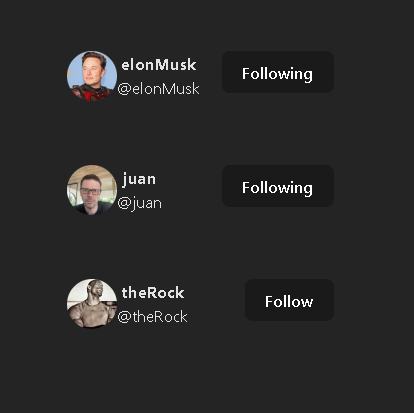

# Cards follow twitter

## Overview
mini project of the card system that uses Twitter of the followers that a user follows

### Table of Contents
- Technologies Used
- Project Structure
- preview
- Installation
- Install Dependencies
- Run the Application


## Technologies Used

- ```React```: Used for building the user interface and managing component states.
- ```Vite```: Utilized as the development environment and build tool for its fast performance and efficient bundling.
- ```CSS```: For styling the application, ensuring a clean and responsive design.

## Project struture
``` 
┣ docs
┃ ┗ images
┃ ┃ ┗ doc_image.png
┣ public
┃ ┗ data.json
┣ src
┃ ┣ assets
┃ ┃ ┣ App.css
┃ ┃ ┣ index.css
┃ ┃ ┗ TwitterCard.css
┃ ┣ App.jsx
┃ ┣ main.jsx
┃ ┗ TwitterCard.jsx
┣ .eslintrc.cjs
┣ .gitignore
┣ index.html
┣ package.json
┣ README.md
┗ vite.config.js
```


### preview



### Installation
```
git clone https://github.com/JUANDGG/cards_follow_twitter.git
cd cards_follow_twitter
```
### Install Dependencies

```
npm install
```
### Run the Application
```
npm run dev
```